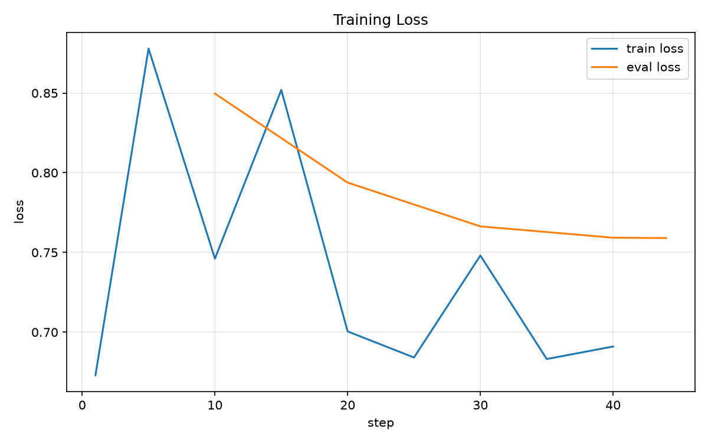
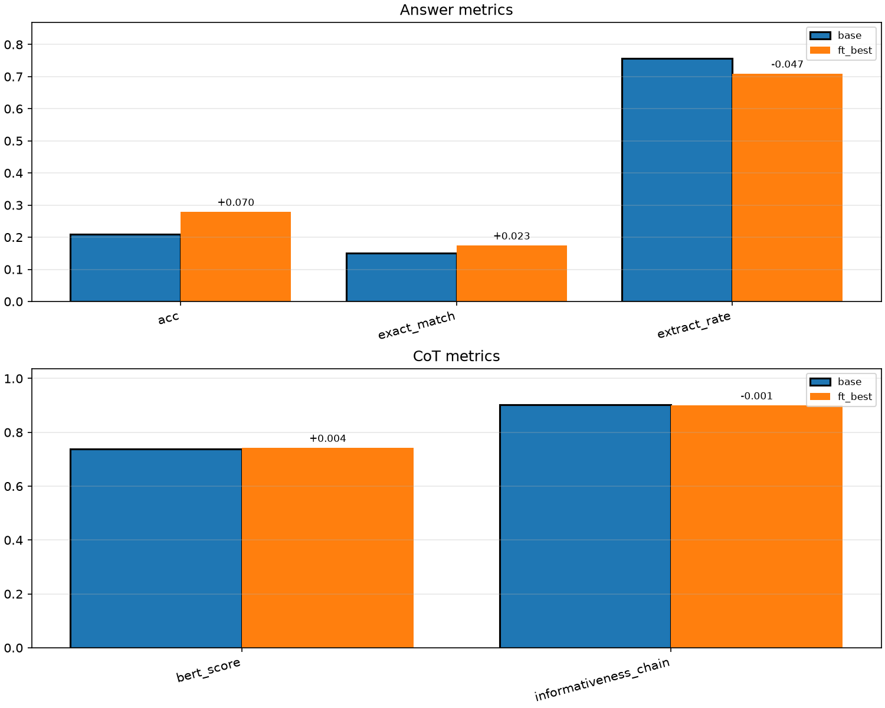

# Math CoT Pipeline

**Language:** [中文](README_CN.md) | [English](README_EN.md)

End-to-end math Chain-of-Thought pipeline: data cleaning → LoRA SFT → dual-track eval (answer + CoT) → multi-run report → optional vLLM.

- **Full guide (English):** [README_EN.md](README_EN.md)
- **完整中文文档:** [README_CN.md](README_CN.md)
